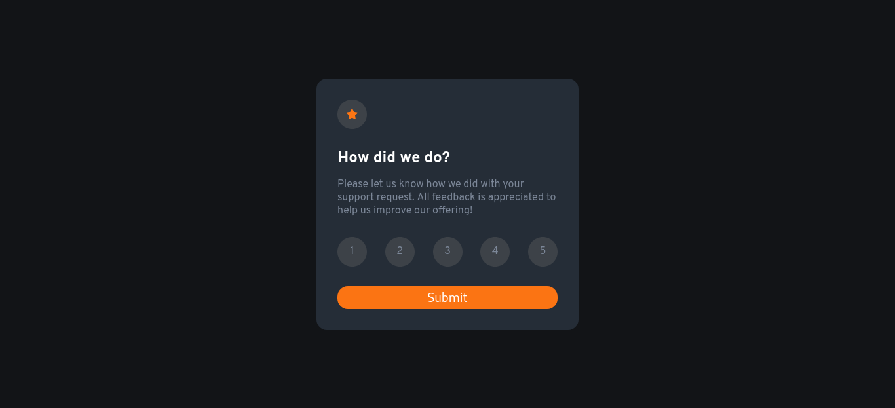

### The challenge

Users can be able to:

- View the optimal layout for the app depending on their device's screen size
- See hover states for all interactive elements on the page
- Select and submit a number rating
- See the "Thank you" card state after submitting a rating

### Screenshot

---

---

---

---

## My process

### Built with

- Semantic HTML5 markup
- CSS custom properties
- Flexbox
- Javascript

### What I learned

From this project i learned some new things like css variables and brushed up my knowledge of javascript.
and also made my knowledge of flexbox strong.

## Author

- Website - [Portfolio](https://pravin0607.github.io/portfolio/)
- Twitter - [Pravin_0607](https://twitter.com/pravin_0607)
